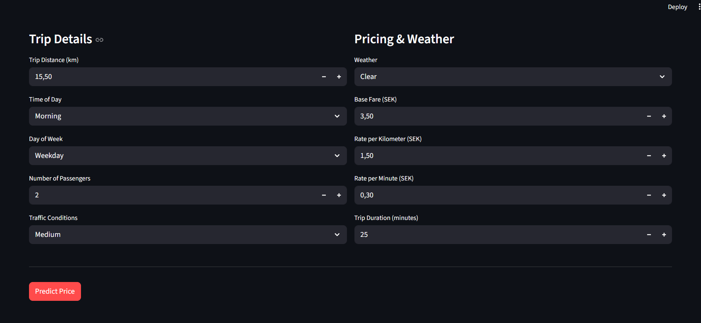
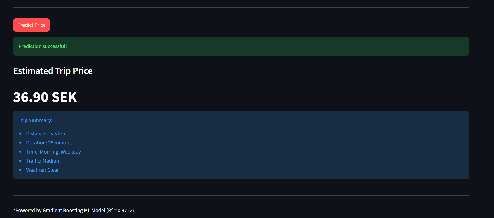
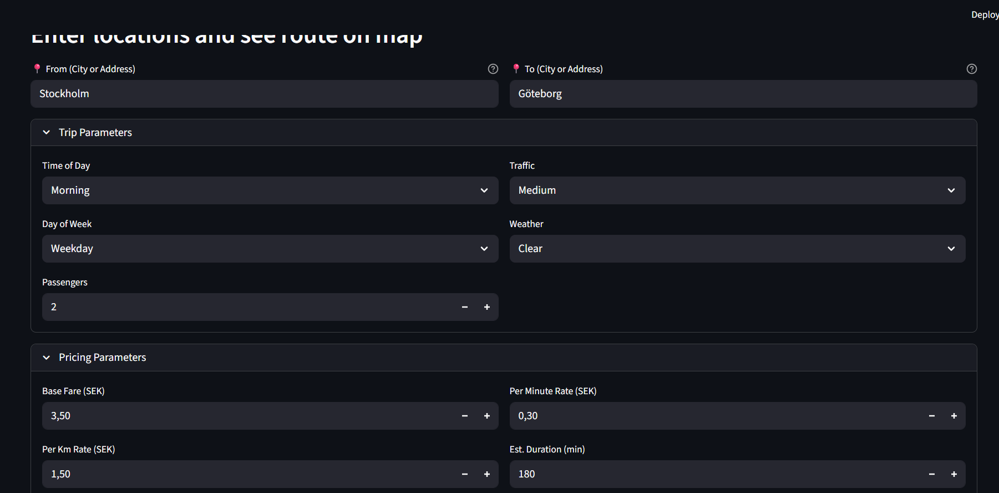
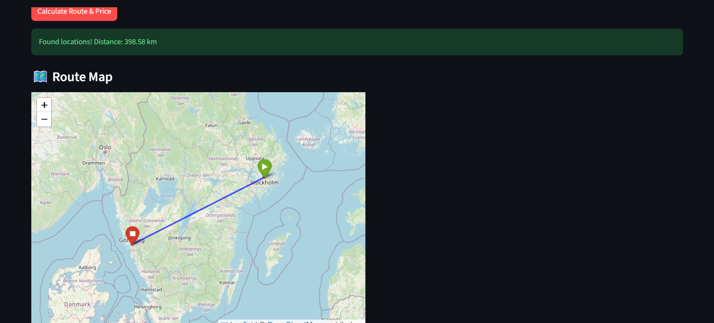
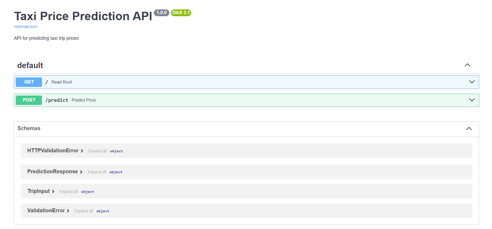

# Taxi-prediction-fullstack-Jasmin

This project is a fullstack application that predicts taxi prices based on several different factors such as distance, time, weather and traffic.

## The application consists of:
- Backend (FastAPI), serves data and handles predictions
- Machine Learning model, trained on taxi data
- Frontend (Streamlit), where the user can view the dataset and test predictions

## EDA & Data Cleaning
The following steps were performed in Jupyter Notebook:
- Dataset analysis
- Handling missing values
- Removing outliers
- Selecting relevant features

The cleaned data was exported to 'final_data.csv'.

## Machine Learning Model
Several models were tested (Linear Regression, KNN, Random Forest)
Gradient Boosting achieved the best results and was selected as the final model

The trained model was saved as 'final_model.joblib'.


## Backend - FastAPI
The backend loads the ML model and provides two endpoints:
- GET /taxi/data returns the cleaned taxi data
- POST /taxi/predict receives user input and returns a calculated taxi price


## Frontend - Streamlit
The application consists of two pages:
- View data, displays the cleaned taxi data in table format directly from the backend
- Predict Taxi Prices, a form where the user enters trip details and gets a predicted taxi price
- Route-based Prediction, user enters locations and sees route on map with calculated price


## Application Screenshots

### Basic Interface


### Basic Prediction


### Route Interface


### Route Map


### Route Prediction Result


### Backend API Documentation



## Start application
Start Backend:
```bash
uv run python -m uvicorn taxipred.backend.api:app --reload --host 0.0.0.0 --port 8000
```

Start Frontend (in new terminal):
```bash
uv run streamlit run src/taxipred/frontend/app.py
```

The API will be available at http://localhost:8000
The frontend will open automatically at http://localhost:8501